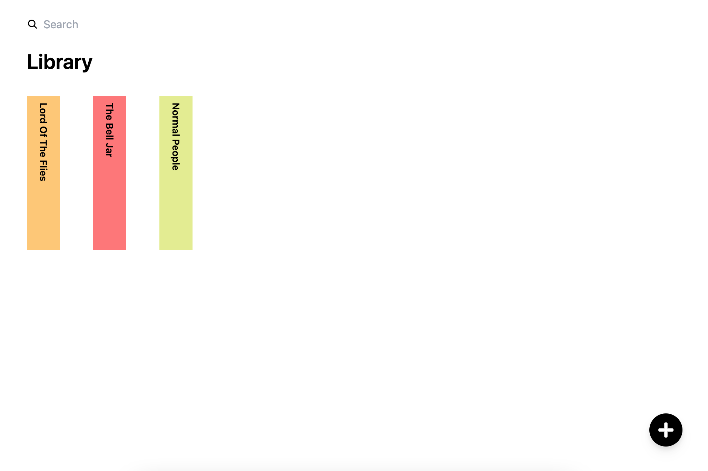
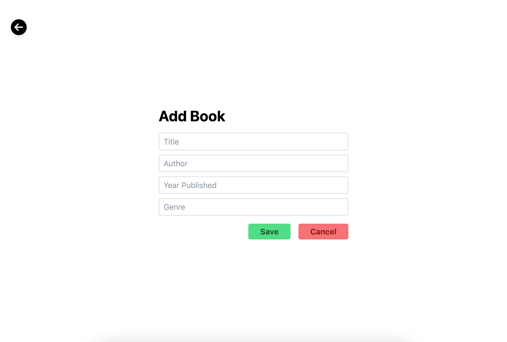

# Objective

Build a Full Stack application that manages a library of books. Hard code a list of books to start with in memory on server side.

## Screenshots




## Run Locally

### Prerequisites

-   [Node.js](https://nodejs.org/)
-   [npm](https://www.npmjs.com/)

### Installation

**Clone the Repository**

First, clone the repository or download it as a ZIP file:

```bash
git clone https://github.com/paigebraun/library.git
```

**Navigate to the Project Directory**

```bash
cd library
```

## Setting Up the Server

**Navigate to the Server Directory**

```bash
cd server
```

**Install Dependencies**

```bash
npm install
```

**Start the server**

```bash
npm run start
```

The server should now be running. By default, it listens on port 3000, but this can be configured in the server settings.

## Setting Up the Client

**Navigate to the Client Directory**

```bash
cd ../client
```

**Install Dependencies**

```bash
npm install
```

**Start the client**

```bash
npm run dev
```

The client should now be running and accessible at http://localhost:5173.
